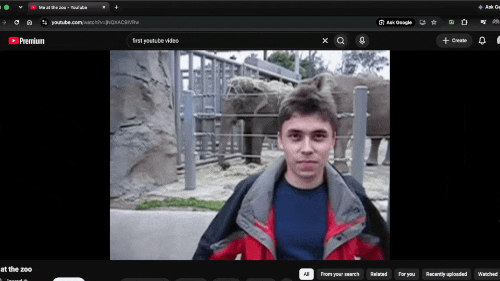
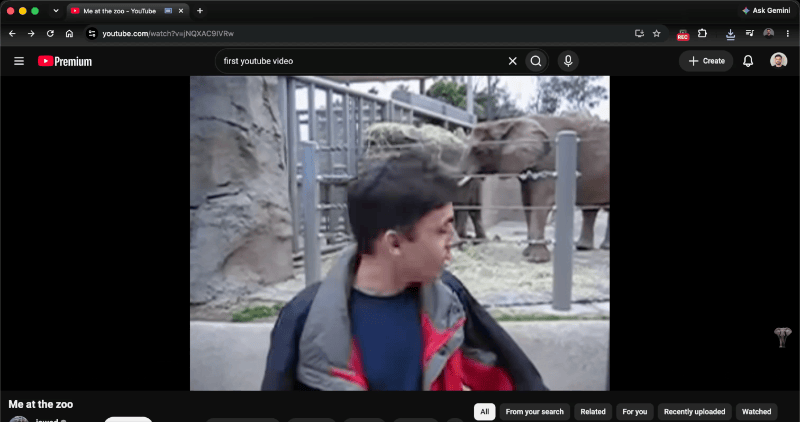
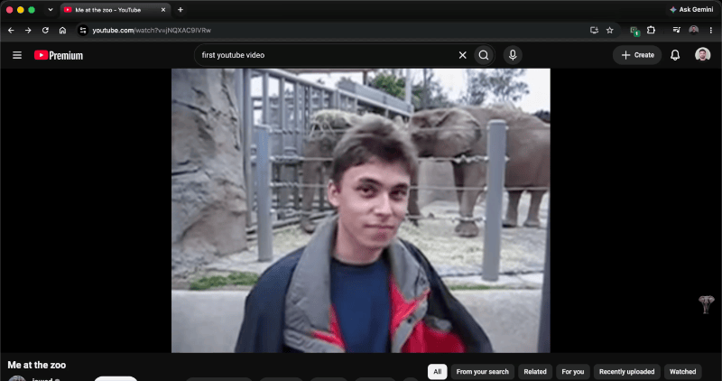

# Play Capture

A local-only Chrome extension that records the picture and sound produced by the active browser tab. It is designed for players that use segmented or temporary media URLs, where ordinary “video downloader” extensions cannot find one downloadable file.

This project records the tab through Chrome's supported capture APIs. It does not download source media, bypass DRM, or send recordings to a server.

## Why this exists

This project is intended as a personal backup tool for courses and other video content that a user is authorized to access—for example, a course they purchased and want to keep available for personal study in case the provider's website is discontinued or access is lost in the future.

The recordings are intended to remain private and are not intended for redistribution, resale, public posting, or sharing someone else's course materials. Users are responsible for confirming that recording is allowed by the provider's terms and by the laws that apply to them; paying for access does not automatically grant permission to copy or distribute content.

## Status

The current stable release is version 1.0.0. The project has automated unit coverage for the content-script video lifecycle, but browser-level capture tests are still manual.

## What it does

- Arms tab capture after the required user click, but starts the saved file only when the lesson video starts playing.
- Requests MP4 when Chrome supports a compatible MP4 codec, with WebM/Opus as an alternative fallback.
- Requires Chrome to provide an audio track and records it at 192 kbps; otherwise capture stops with an error instead of silently saving a video-only file.
- Keeps tab audio audible while recording.
- Watches HTML `<video>` elements in the page and cross-origin embedded frames.
- Stops automatically when the active video ends, pauses on its final frame, or disappears from the player.
- Pauses the file immediately when the lesson is paused. It stays paused until playback resumes or you click **Finish now**; it does not stop automatically just because the video is paused.
- Also provides a manual Stop button for custom players or live streams.
- Stores finished recordings locally in extension storage until Download or Remove is clicked.
- Includes a persistent on/off switch and turns the toolbar icon gray while off. Even while on, page monitoring starts only after **Start** is clicked.
- Shows whether each saved recording is not downloaded, downloading, downloaded, or failed.
- Downloads every unfinished recording to Chrome's normal Downloads folder with **Download all**.
- Does not upload video, browsing data, or recordings to a server.

## What this is—and is not

This is a playback-aware recorder, not a general-purpose media downloader. It captures what Chrome renders in the tab instead of locating, extracting, decrypting, or joining the original media streams.

That tradeoff is deliberate. Stream downloaders can sometimes offer source-quality selection, HLS/DASH segment joining, subtitles, or faster-than-real-time downloads. This extension is useful when the player uses temporary URLs, MediaSource/blob data, cross-origin embeds, or another delivery method that does not expose one convenient downloadable file. It records the authorized playback locally and starts and stops with the lesson video.

## Install for development

1. Open `chrome://extensions` in Chrome 116 or newer.
2. Enable **Developer mode**.
3. Click **Load unpacked**.
4. Select this project directory.
5. Reload any course/video page that was already open so Chrome can add the end detector.

## Install a GitHub release (non-developers)

1. Open the [Play Capture Releases page](../../releases) and download the ZIP asset for the release you want, such as `play-capture-v1.0.0.zip`.
2. Unzip the downloaded file into a folder. Do not select the ZIP file itself in Chrome.
3. Open `chrome://extensions` in Chrome 116 or newer.
4. Enable **Developer mode**, click **Load unpacked**, and select the unzipped `play-capture` folder.
5. Pin the extension if desired, then follow the [Use](#use) steps below.

Chrome requires Developer mode for locally installed unpacked extensions. The release ZIP contains only the files needed to run Play Capture; it does not install anything outside the selected extension folder.

## Use

1. Open the page containing the video in the active tab.
2. Click the extension icon and click **Start**. The extension now waits without writing a file.
3. Press Play on the lesson video. Recording starts from that moment.
4. If you pause the video, recording pauses too and remains paused indefinitely. Resume playback to continue, or click **Finish now** in the extension to save what has been captured.
5. Keep the video tab open and playing. The popup can be closed.
6. When the video ends, open the extension and download the finished recording. The item changes to **Downloaded** only after Chrome finishes saving the file. The file extension reflects the format Chrome actually selected.

### Examples

#### Start recording

Click **Start**, then play the video. Play Capture begins recording when the video starts playing.



#### Pause recording

Pause the video to pause the recording. Resume the video to continue recording.



#### Save a finished recording

When the recording is finished, open Play Capture and download the saved video.



Use **Download all** to save every item marked **Not downloaded** or **Download failed**. Individual downloads still let you choose where to save the file; bulk downloads use Chrome's normal Downloads folder.

If the player does not expose a normal HTML video end event, open the extension and click **Stop recording** yourself.

If Play Capture does not work as expected, click **Report a bug** at the bottom of the extension. This opens a structured bug report on GitHub in a new tab. Reports are not sent automatically, and recordings remain on your device.

## Important limits

- Protected DRM video may appear black or may not allow capture. This extension does not bypass DRM or access controls.
- Recording is real-time: a 30-minute video takes 30 minutes to record.
- Long recordings use browser memory while recording and disk space after they finish. Test shorter videos before recording something important.
- It does not preserve the original stream or guarantee the source video's resolution, bitrate, captions, or metadata. A direct downloader may produce a smaller, faster, or higher-quality file when the provider exposes an authorized downloadable stream.
- A tab can only be captured after a user clicks the extension. Chrome does not allow silent automatic capture.
- MP4 playback behavior depends on Chrome, the operating system, and the video player. WebM with Opus is available as an alternative if a particular player has trouble with MP4.
- **Remove** removes the recording from this extension's local saved-recordings list and storage. It does not remove files you already downloaded to your Downloads folder. **Clear all** does the same for every saved recording.
- **Downloaded** means Chrome finished the download successfully. The extension does not keep checking whether the file is later moved or deleted outside Chrome.

Only record media you own or have permission to save.

## Project layout

- `background.js` manages capture state and Chrome APIs.
- `offscreen/` owns `MediaRecorder`, local IndexedDB storage, and file creation.
- `content.js` detects when the page's playing video ends.
- `popup/` contains the extension interface.

## Permissions and privacy

The extension requests these permissions for the following reasons:

- `activeTab` and `tabCapture`: capture the tab only after the user starts a recording.
- `scripting`: load the video monitor only after the user starts a recording.
- `downloads`: save a finished recording through Chrome's download manager.
- `offscreen`: run `MediaRecorder`, audio routing, and Blob work outside the service worker.
- `storage` and `unlimitedStorage`: keep capture state and finished recordings locally.
- `<all_urls>`: let the user-started video monitor work in ordinary pages and embedded cross-origin frames. No page-monitoring script is loaded until **Start** is clicked.

Recordings are stored in the extension's local IndexedDB database until they are downloaded or removed. The extension has no network client, analytics, account system, or remote upload path.

## Development

The project intentionally has no runtime npm dependencies. Use Node.js 18 or newer for the test command:

```sh
npm test
npm run package
```

`npm run package` creates `dist/play-capture-v1.0.0.zip`. The archive contains only `manifest.json`, `background.js`, `content.js`, `offscreen/`, `popup/`, and `assets/`; tests, documentation, agent files, IDE files, and other development metadata are excluded. The packaging command uses only Node.js built-ins and adds no npm dependencies.

## GitHub releases

To prepare a release as a developer:

1. Confirm the version in `package.json` and `manifest.json` is the same. This release is `1.0.0`.
2. Run `npm test` and `npm run package`.
3. Inspect the ZIP in `dist/` and commit the source changes.
4. Create and push a matching version tag, for example `git tag v1.0.0 && git push origin v1.0.0`.

The GitHub Actions workflow runs the tests and packaging command for `v*` tags, then attaches the generated ZIP to a GitHub Release. The package version is read from `package.json`, so the tag without its leading `v` must match it.

For a browser smoke test, load the repository as an unpacked extension in Chrome 116 or newer, open a page with a non-DRM HTML video, and follow the usage steps above. Test both formats, pause/resume, automatic completion, manual stop, download, and removal.

GitHub Actions runs the same test command on pushes and pull requests.

## Contributing

Keep the extension local-only, require an explicit user action before capture, and update the README when permissions, supported Chrome versions, recording formats, or storage behavior change. Add or update tests for content-script lifecycle changes. See [CONTRIBUTING.md](CONTRIBUTING.md) for the lightweight contribution checklist.

## Agent and repository guidance

The canonical project guidance for coding agents is [`AGENTS.md`](AGENTS.md).

## Automated checks

Run `npm test`. The tests cover waiting for Play, automatic stopping at the true end, pausing indefinitely, resuming, and the embedded-player final-frame fallback.
